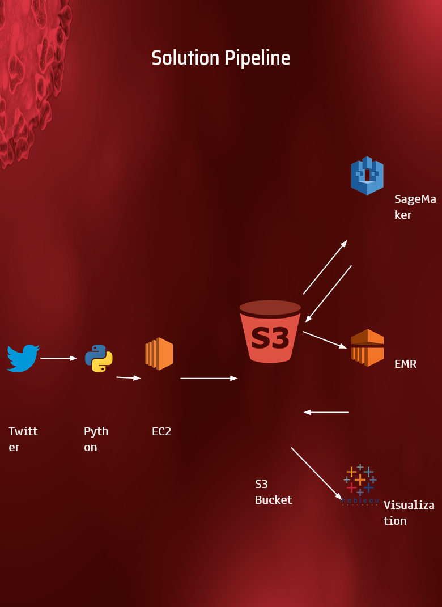
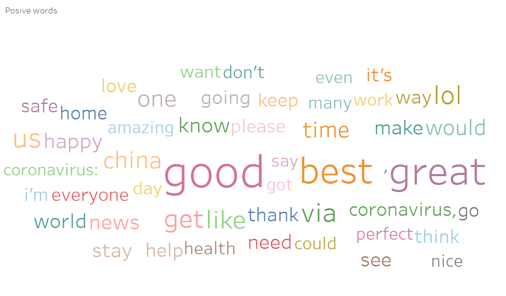
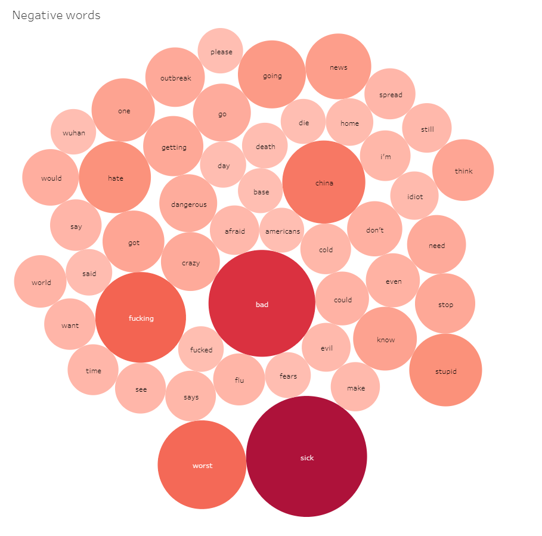
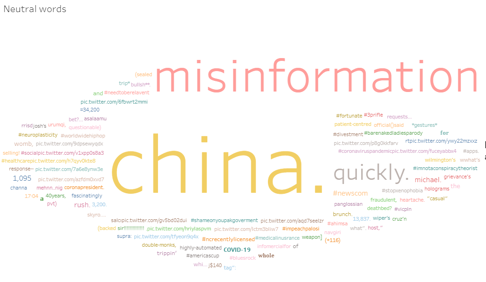

# Covid19 Sentiment analysis on AWS Sagemaker

This repository contain notebook to preprocess and train sentiment analysis model on AWS Sagemaker

## Pipeline

## Dashboard

The sentiment analysis solution is deployed on tableau dashboard available at:
https://public.tableau.com/app/profile/khaqan.ashraf/viz/Book2_15930855129620/Dashboard

## Results

Few results of each sentiment are shown below:

